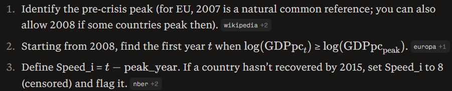
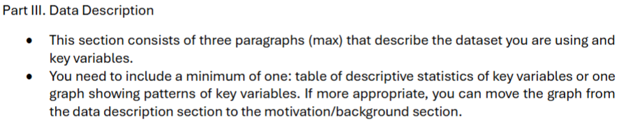
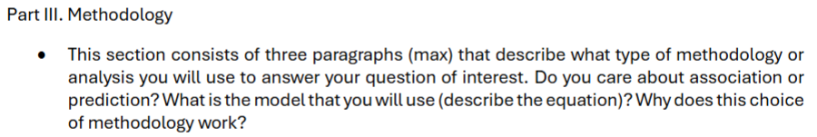
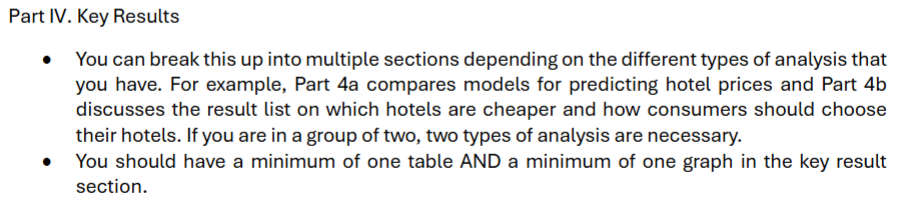

# Final Project - Jonas Nepozitek

## Ardina Notes

- Instead of cross-country, you can also consider doing some within-country studies and look at variation at the state-level. This means that you’ll need state-level data and it depends on the country or countries that you choose. Some of the variables might be something that you’ll need to create.
  - **Find datasets for cross-country and intra-country**
- There is literature on measuring state capacity. It’s an interesting literature. Think about which measurements you are using and why.
  - **Find papers and datasets on state-capacity**
  - **Define properly**
- Narrow down some outcome variables. Are you just going to look at GDP?
  - **Consider other reelvant variables besides GDP**
  - **Options: ???**
- During or after Spring Break, I want you to focus on choosing one of the questions and narrow down a dataset + variables. Looking through some articles might be helpful as a starting point. You will know what data is available and think about if you can replicate for a different region/timeframe or extend the analysis of some papers (such as using similar methods but adding your manufacturing variable of interest).
  - **Find similar papers and readjust for time/geography/other**

### Research Scope

- **Main question:** How did countries withstand differently the effects of the 2008 financial crisis depending on their shares of manufacturing within the overall economies?
- **Possible subquestion:** How did state capacity / quality of governance / strength of institutions affect the ability of countries to withstand the 2008 FC?

### Possible Papers

- [Recovery From Financial Crises](papers/reinhart-rogoff-2014-recovery-from-financial-crises-evidence-from-100-episodes.pdf)
  - Uses real per capita GDP
  - You can adopt their “years to regain peak” as an outcome, or at least echo their framing when you define persistent losses.

- [IMF Working Paper](papers/wpiea2019083.pdf)
  - GDP PPP
  - Pre‑crisis financial vulnerabilities, fiscal positions, and exchange rate flexibility are key determinants of post‑crisis losses.

### Possible datasets

- World Bank GDP Data
  - NY.GDP.MKTP.KD.ZG: GDP growth (annual %)
  - NV.IND.MANF.ZS: Manufacturing, value added (% of GDP)
- Global Economic Diversification Index
  - Diversification index
- World Bank Worldwide Governance Indicators
  - Construct a standardized aggregate of the various dimensions (through z-scores)

- For all key explanatory variables, we want to use pre_crisis numbers, as we want to explain by the ex-ante structure

- EMPLOYMENT???

### Possible Control Variables

- Credit-to-GDP or private credit growth
- Pre-crisis current account balance or external debt
- Pre-crisis fiscal balance / debt (buffers)
- Exchange rate regime dummy
- Region/income group dummies
- Euro?

### Possible outcomes

- Depth of crisis
  - Peak‑to‑trough: maximum fall in log GDP per capita between 2007 and say, 2012
- Speed of recovery
  - 

### Identification

- Endogeneity of manufacturing share: institutions and policy choices shape industrial structure.
- Omitted variables: political history, geography, colonial legacy, EU/Eurozone membership, etc.
- Emphasize ex‑ante measures (2000–2007 averages) to mitigate reverse causality.
- Show robustness: with and without controls (credit growth, fiscal balance, etc.).
- Sign and magnitude of β1 (structural effect), β2 (capacity effect), and especially β3 (complementarity).
- Use predicted values or marginal effects plots to illustrate how manufacturing matters at low vs high governance levels.

## Write-Up

### Data Description Write-Up (due Apr 4)

### Methodology Write-Up (due Apr 11)

### Key Results (Due Apr 25)

