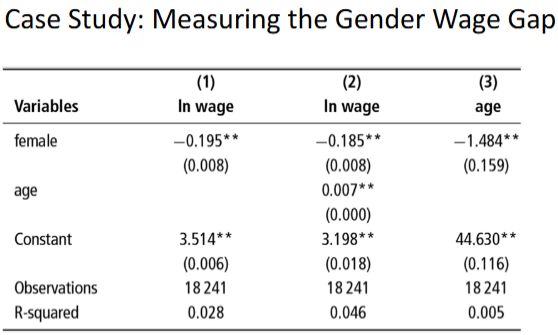
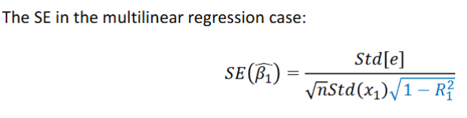

# Multiple Linear Regression

## Two-variable version

- $y^E=\beta_0+\beta_1x_1+\beta_2x_2$
  - $\beta_0$ -> the conditional mean of y when both x1 and x2 are 0 (when everything is 0)
  - We usually don't interpret it

- Example: $lnwage^E=\beta_0+\beta_1yearsedu+\beta_2age$
  - Interpretation: On average, y is $\beta_1$ units larger for observations with one unit larger $x_1$ but with the same $x_2$
  - Becomes a linear hyperplane

- On average, women earn about 18.5% less than men, holding age constant
  - Not exactly precise. 18.5 logs is around 21%.
- People who are one year older tend to have a 0.7% higher wage on average

## Multilinear v. simple

- $y^E=\beta_0+\beta_1x_1+\beta_2x_2$
- $y^E=\alpha+\beta x_1$
- Suppose that
  - y is the log of sales
  - x1 is the log price of your product
  - x2 is the log price of your competitor's product
- Relationship between prices: $x^E_2 = \gamma + \delta x_1$
- Combining the three equations and simplifying:
  - $y^E = \beta _0 + \beta _0 \gamma + (\beta _1 + \beta _2 \delta) x_1$
- $\ln{sales _{own}} ^E = \alpha - 0.5 \ln{price _{own}}$
  - As your prices increases by one per cent, your sales decrease by 0.5 per cent
- $\ln{sales _{own}} ^E = \beta _0 - 3 ln price _{own} + 3 ln price _{comp}$
  - Holding competitor price constant, as your price increases by one per cent, your sales decrease by 3 per cent. And vice versa
- $\ln{sales _{own}} ^E = \gamma + 0.83 ln price _{comp}$
  - As competitor's prices increase by one per cent, your prices increase by 0.83 per cent

- Negative bias if we don't include age
- Because females are younger on average (model 3), the gap is larger if we don't control for age

- The blue part is different from a simple lin reg case
- R1 measures correlation between x1 and x2
- The stronger the correlation, the larger the SE
  - If two things move so close together, you don't know what happens if they move independently.
  - Multicollinearity
